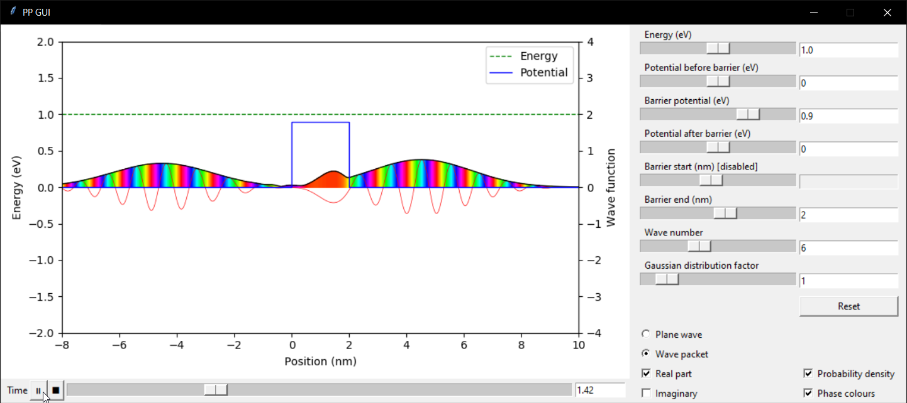

# GUI for the potential barrier

Graphical interface enabling to modify parameters of a wave function passing through a potential barrier in real time. For information on how the calculations are made check [calculations](calculations.pdf)

Created by [Loric Vandentempel](https://github.com/loricvdt/)

## Dependencies

The packages needed to run this code are **tkinter**, **time**, **threading** (these may already come with the Python installation), **matplotlib** and **numpy**

## Usage

To run the application, use Python 3: `python main.py` or `python3 main.py`

All parameters are settable using the available sliders on the right side or by entering the value in the text boxes next to them and pressing `Return`

The potential barrier and the energy level can also be edited directly on the graph by dragging the corresponding line

At the bottom are the controls for the time (Play/Pause, Stop and the corresponding slider and text box)

Radio buttons also control whether the graph shows a plane wave or a gaussian wave packet and check boxes control what part of the complex wave function is displayed

## Screenshot

