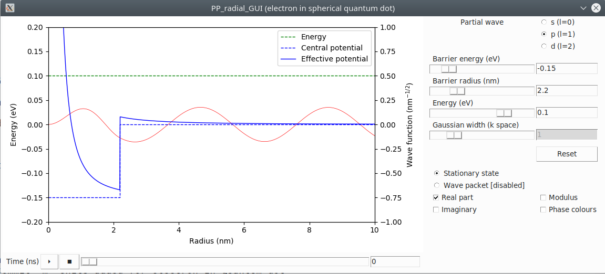

# GUI for a spherical square potential barrier

Graphical interface enabling to modify the parameters (angular momentum, potential radius, depth, energy...) of a wave function

## Dependencies

The packages needed to run this code are **tkinter**, **time**, **threading** (these may already come with the Python installation), **matplotlib**, **numpy**, **scipy.constants**, **scipy.special**

## Download

To download the code, either use GitHub to download (and clone!) the whole PP project, or simply download the zipped file containing the source code [PP_radial_GUI.zip](PP_radial_GUI.zip) and extract files from it.

## Usage

To run the application, use Python 3: `python main.py` or `python3 main.py`

All parameters are settable using the available sliders on the right side or by entering the value in the text boxes next to them and pressing `Return`

The potential barrier and the energy level can also be edited directly on the graph by dragging the corresponding line

At the bottom are the controls for the time (Play/Pause, Stop and the corresponding slider and text box)

Radio buttons also control whether the graph shows a stationary state or a gaussian wave packet and check boxes control what part of the complex wave function is displayed

## Screenshot

